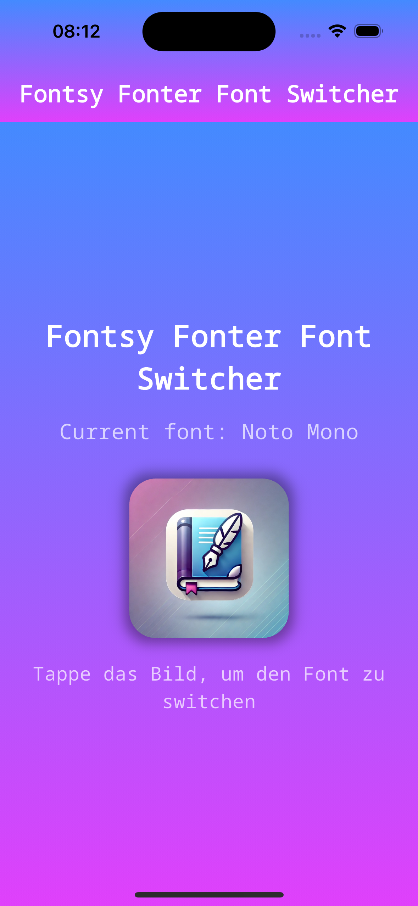

# fontsy_fonter_font_switcher

Diese kleine App demonstriert die Verwendung von Fonts in Flutter.

Es kann zwischen zwei Fonts gewechselt werden.

## Starten der App

Möglicherweise muss `flutter pub get` im Terminal ausgeführt werden oder Flutter: Get Packages in Visual Studio Code gestartet werden.

## Screenshot

 